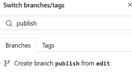

## Get Started
This is not an introduction to GitHub. It's easy to create an account. After you login, use these steps to create a new repository and publish it "as is" without editing any files. This simply confirms that your site will build and deploy.

### Create the Repository
1. Open [TR-System/modernist](https://github.com/tr-systems/modernist){:target="_blank"}
2. Click the button in the upper right to Use this Template
3. Give your repo a web-friendly name. DO NOT include all branches. If using a personal account, you must create a public repo, and only one of your public repos can have a website. This restriction does not apply for Team accounts.
4. Click Create repository
5. The repo will be copied and created.
6. Create the **publish** branch by clicking on the **edit** branch button, then type "publish" and press <kbd>Enter</kbd>. As show here by clicking this button, too:

<button type="image" onclick="editButtonClick()" style="margin-left:24px; margin-bottom:6px; padding:0;">

</button>

### Publish the Site
1. Click the repo **Settings** button
2. In the nav bar on the left, scroll down and click **Pages**
3. Under Build and Deploy: Deploy from branch: **publish** /root. Click **Save**.
4. GitHub will kick off the Pages Build and Deploy action
5. Click on **Actions** to watch that process run
6. Go back to **Settings/Pages** and click the link to visit your site

### Start Writing
All you need to do now is start editing and writing.

Add or update pages in the edit branch, then create a pull request into the publish branch.

There are a number of ways to create the pull request. Here's the one I use:

1. After committing a change to the edit branch, do this:
2. Switch to the publish branch. You will see that it is **1 commit behind** the edit branch. **Click on that link**.
3. Comparing Changes appears. Scroll down to view the proposed changes. 
Click Create pull request
4. Open a Pull Request appears, where you can enter a title (required), optional description and view the changes again. 
Click Create pull request again
5. GitHub checks to see if there are any conflicts between the two branches. There won't be as long as you NEVER commit any changes directly to the publish branch. 
Click Merge pull request
7. Click Confirm Merge
8. Click Actions to watch **Pages Build and Deploy** run.

Voila, web sites made easy! Have fun!
