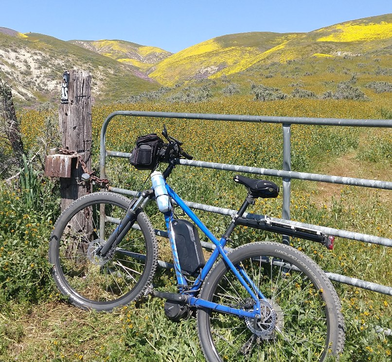

## Style Sheet Test Page

#### Table Testing
Trying to fill a table data cell with a background color.

| Hex Code | Color |
| -------- | ----- |
| #6C7989 |  x  |
| next | next |

| Type | Model | Firmware | Web Version | Purchased |
| ---- | ----- | -------- | ----------- | --------- |
| Outdoor Mini-Dome (4) | DS-2CD-2543-G0-IS | v5.5.61 b180718 v5.6.820 b220519 v5.6.821 b230831 | v4.0.1 b180626 v4.0.1 b220610 | 3 in 2018 1 in 2023 |
| Indoor Cube w/PIR | DS-2CD-2422-FWD-IW | v5.5.0 b170725 | v4.0.1 b170711 | 2018  |
| Outdoor PTZ Mini-Dome | DS-2DE-3404-W-DE | v5.7.4 b221130 v5.8.1 b231108 | v4.0.1 b220121 | 2024 |
| NVR | DS-7604-NI-Q1 | v4.32.110 b211009 | v4.0.1 b210914 | 2024 |

---

#### Picture Testing
Style sheet provides the background, padding and border. Width=20% in markdown controls the size.

 Here is what you need to do.

You can and should first read the Disclaimers below and then test this yourself by connecting the ports, enabling and arming your Alarm Input and Output Events, and then triggering a manual alarm from the Alarm Out event on your camera (don't forget to clear it). See additional notes on the jumper wire in Camera Configuration below.

You can and should first read the Disclaimers below and then test this yourself by connecting the ports, enabling and arming your Alarm Input and Output Events, and then triggering a manual alarm from the Alarm Out event on your camera (don't forget to clear it). See additional notes on the jumper wire in Camera Configuration below.

---

#### Pipe Testing
Using the Pipe/Vertical Bar Symbol yields table cells

| One pipe, one table data cells

| Two bars with image after the second | 

Fun stuff...

---

End of Document
